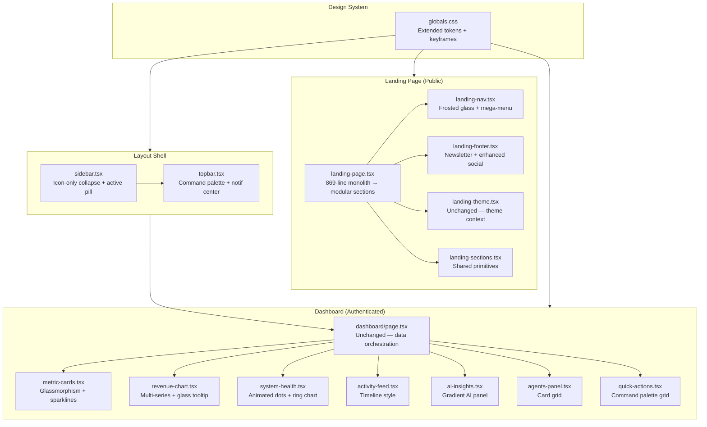

# Design Document: NexoraGrid UI/UX Redesign

## Overview

NexoraGrid is an AI-powered business infrastructure OS serving energy companies, enterprises, and governments. The current UI, while functional, lacks the visual polish and interaction depth of world-class SaaS products like Linear, Vercel, Stripe, and Raycast. This redesign elevates every surface — the public landing page and the authenticated dashboard — to a premium, command-center aesthetic that communicates trust, power, and intelligence at a glance.

The redesign is a **complete in-place rewrite** of 12 existing files. No new directories, no new npm packages. Every enhancement is achieved using the existing stack: Next.js 14, TypeScript, Tailwind CSS, Framer Motion, Recharts, Radix UI, Lucide React, Zustand, and SWR. The design system is extended via `globals.css` CSS custom properties and new Tailwind utility classes. All components remain at their current file paths.

The guiding principle is **progressive disclosure of complexity**: the landing page draws visitors in with cinematic visuals and clear value propositions, while the dashboard rewards power users with dense, information-rich panels that feel alive with real-time data.

---

## Architecture Diagram



---

## Design System Specification

### Color Tokens (extends globals.css)

```css
/* Brand gradients */
--gradient-brand:    linear-gradient(135deg, #6366f1 0%, #a855f7 50%, #06b6d4 100%);
--gradient-hero:     linear-gradient(135deg, #0f0c29 0%, #302b63 50%, #24243e 100%);
--gradient-mesh:     radial-gradient(ellipse at 20% 50%, rgba(99,102,241,0.15) 0%, transparent 50%),
                     radial-gradient(ellipse at 80% 20%, rgba(168,85,247,0.10) 0%, transparent 50%),
                     radial-gradient(ellipse at 60% 80%, rgba(6,182,212,0.10) 0%, transparent 50%);

/* Glass surfaces */
--glass-bg:          rgba(255,255,255,0.03);
--glass-bg-md:       rgba(255,255,255,0.06);
--glass-bg-strong:   rgba(255,255,255,0.10);
--glass-border:      rgba(255,255,255,0.08);
--glass-border-md:   rgba(255,255,255,0.12);

/* Glow shadows */
--glow-indigo:       0 0 40px rgba(99,102,241,0.30);
--glow-indigo-lg:    0 0 80px rgba(99,102,241,0.20), 0 0 160px rgba(99,102,241,0.10);
--glow-cyan:         0 0 40px rgba(6,182,212,0.30);
--glow-purple:       0 0 40px rgba(168,85,247,0.30);
--glow-emerald:      0 0 40px rgba(16,185,129,0.30);

/* Semantic surface tokens */
--surface-0:         #07071a;   /* page background */
--surface-1:         #0d0d2b;   /* card background */
--surface-2:         #12122e;   /* elevated card */
--surface-3:         #1a1a3e;   /* hover state */
```

### Typography Scale

| Token | Size | Weight | Line Height | Usage |
|-------|------|--------|-------------|-------|
| `display-2xl` | 72px / 4.5rem | 800 | 1.05 | Hero headline |
| `display-xl` | 60px / 3.75rem | 700 | 1.08 | Section headlines |
| `display-lg` | 48px / 3rem | 700 | 1.10 | Sub-section heads |
| `heading-xl` | 30px / 1.875rem | 600 | 1.25 | Card titles |
| `heading-lg` | 24px / 1.5rem | 600 | 1.30 | Panel headers |
| `body-lg` | 18px / 1.125rem | 400 | 1.70 | Hero body copy |
| `body-md` | 16px / 1rem | 400 | 1.60 | Standard body |
| `body-sm` | 14px / 0.875rem | 400 | 1.50 | Secondary text |
| `label` | 12px / 0.75rem | 500 | 1.40 | Labels, badges |
| `mono` | 13px / 0.8125rem | 400 | 1.50 | Code, metrics |

Font stack: `Inter var, Inter, system-ui, -apple-system, sans-serif`

### Spacing System (8px grid)

```
4px  → gap-1   (micro spacing, icon gaps)
8px  → gap-2   (tight spacing)
12px → gap-3   (compact elements)
16px → gap-4   (standard element spacing)
24px → gap-6   (section internal spacing)
32px → gap-8   (card padding)
48px → gap-12  (section padding)
64px → gap-16  (large section gaps)
96px → gap-24  (section vertical padding)
112px → py-28  (hero/CTA sections)
```

### Shadow System

```css
/* Elevation levels */
--shadow-sm:   0 1px 2px rgba(0,0,0,0.4);
--shadow-md:   0 4px 12px rgba(0,0,0,0.3), 0 1px 3px rgba(0,0,0,0.2);
--shadow-lg:   0 8px 32px rgba(0,0,0,0.4), 0 2px 8px rgba(0,0,0,0.2);
--shadow-xl:   0 20px 60px rgba(0,0,0,0.5), 0 4px 16px rgba(0,0,0,0.3);
--shadow-2xl:  0 40px 100px rgba(0,0,0,0.6);

/* Brand glow shadows */
--shadow-indigo: 0 8px 32px rgba(99,102,241,0.35), 0 2px 8px rgba(99,102,241,0.20);
--shadow-cyan:   0 8px 32px rgba(6,182,212,0.30),  0 2px 8px rgba(6,182,212,0.15);
```

### Responsive Breakpoints

| Breakpoint | Width | Layout Changes |
|------------|-------|----------------|
| `sm` | 640px | 2-col grids, show desktop nav elements |
| `md` | 768px | 3-col pricing, hide mobile menu |
| `lg` | 1024px | Full desktop layout, sidebar expanded |
| `xl` | 1280px | Max content width, wider bento grid |
| `2xl` | 1536px | Ultra-wide centering |

---

## Animation Specifications

### New CSS Keyframes (globals.css additions)

```css
@keyframes shimmer {
  0%   { transform: translateX(-100%); }
  100% { transform: translateX(100%); }
}

@keyframes float {
  0%, 100% { transform: translateY(0px) rotate(0deg); }
  33%       { transform: translateY(-8px) rotate(0.5deg); }
  66%       { transform: translateY(-4px) rotate(-0.5deg); }
}

@keyframes pulse-glow {
  0%, 100% { box-shadow: 0 0 20px rgba(99,102,241,0.3); }
  50%       { box-shadow: 0 0 40px rgba(99,102,241,0.6), 0 0 80px rgba(99,102,241,0.2); }
}

@keyframes gradient-shift {
  0%   { background-position: 0% 50%; }
  50%  { background-position: 100% 50%; }
  100% { background-position: 0% 50%; }
}

@keyframes marquee {
  0%   { transform: translateX(0); }
  100% { transform: translateX(-50%); }
}

@keyframes count-up {
  from { opacity: 0; transform: translateY(10px); }
  to   { opacity: 1; transform: translateY(0); }
}

@keyframes slide-in-top {
  from { opacity: 0; transform: translateY(-12px); }
  to   { opacity: 1; transform: translateY(0); }
}

@keyframes spin-slow {
  from { transform: rotate(0deg); }
  to   { transform: rotate(360deg); }
}

@keyframes border-flow {
  0%   { background-position: 0% 50%; }
  50%  { background-position: 100% 50%; }
  100% { background-position: 0% 50%; }
}
```

### Framer Motion Variant Library

```typescript
// Shared variants used across components
export const fadeUp = {
  hidden: { opacity: 0, y: 24 },
  visible: (i = 0) => ({
    opacity: 1, y: 0,
    transition: { duration: 0.5, delay: i * 0.08, ease: [0.25, 0.46, 0.45, 0.94] }
  })
};

export const fadeIn = {
  hidden: { opacity: 0 },
  visible: (i = 0) => ({
    opacity: 1,
    transition: { duration: 0.4, delay: i * 0.06 }
  })
};

export const staggerContainer = {
  hidden: {},
  visible: { transition: { staggerChildren: 0.08, delayChildren: 0.1 } }
};

export const scaleIn = {
  hidden: { opacity: 0, scale: 0.92 },
  visible: { opacity: 1, scale: 1, transition: { duration: 0.4, ease: 'easeOut' } }
};

export const slideInLeft = {
  hidden: { opacity: 0, x: -24 },
  visible: (i = 0) => ({
    opacity: 1, x: 0,
    transition: { duration: 0.5, delay: i * 0.1 }
  })
};

// Card hover variants
export const cardHover = {
  rest: { y: 0, boxShadow: '0 1px 3px rgba(0,0,0,0.3)' },
  hover: {
    y: -4,
    boxShadow: '0 20px 40px rgba(99,102,241,0.2), 0 4px 12px rgba(0,0,0,0.3)',
    transition: { duration: 0.2, ease: 'easeOut' }
  }
};
```

### Reduced Motion Support

All animations must respect `prefers-reduced-motion`:

```css
@media (prefers-reduced-motion: reduce) {
  *, *::before, *::after {
    animation-duration: 0.01ms !important;
    animation-iteration-count: 1 !important;
    transition-duration: 0.01ms !important;
  }
  .marquee-track { animation: none; }
}
```

In Framer Motion components, use `useReducedMotion()` hook and conditionally disable variants.

---

## Accessibility Requirements

- **WCAG 2.1 AA** minimum for all interactive elements
- Color contrast ratios: ≥ 4.5:1 for normal text, ≥ 3:1 for large text and UI components
- All interactive elements have visible focus indicators (`ring-2 ring-indigo-500 ring-offset-2`)
- Keyboard navigation: Tab order follows visual reading order; no keyboard traps
- ARIA roles: `role="navigation"`, `role="main"`, `role="complementary"`, `role="banner"`, `role="contentinfo"`
- ARIA labels on all icon-only buttons: `aria-label="Toggle navigation"`, `aria-label="Open command palette"`
- Live regions: `aria-live="polite"` on notification badge count, dashboard refresh status
- Skip link: `<a href="#main-content" className="sr-only focus:not-sr-only">Skip to content</a>`
- Images: All decorative images use `aria-hidden="true"`; informational images have descriptive `alt` text
- Motion: `useReducedMotion()` from Framer Motion disables all animations when user prefers reduced motion
- Form inputs: All inputs have associated `<label>` elements or `aria-label`
- Modals: Focus trapped inside; `aria-modal="true"`, `role="dialog"`, `aria-labelledby` pointing to title
- Color: Information never conveyed by color alone (status dots also have text labels)

---

## Component-Level Design Specifications

### 1. `globals.css` — Design System Extensions

**New utility classes:**
```css
.bento-card        { @apply rounded-2xl border border-white/8 bg-white/[0.03] backdrop-blur-sm p-6 transition-all duration-300; }
.glass-strong      { background: rgba(255,255,255,0.08); backdrop-filter: blur(20px); border: 1px solid rgba(255,255,255,0.12); }
.gradient-border   { position: relative; background: linear-gradient(var(--surface-1), var(--surface-1)) padding-box,
                     linear-gradient(135deg, #6366f1, #a855f7, #06b6d4) border-box; border: 1px solid transparent; }
.marquee-track     { display: flex; animation: marquee 30s linear infinite; width: max-content; }
.marquee-container { overflow: hidden; mask-image: linear-gradient(to right, transparent, black 10%, black 90%, transparent); }
.neon-glow-indigo  { box-shadow: 0 0 20px rgba(99,102,241,0.4), 0 0 40px rgba(99,102,241,0.2); }
.neon-glow-cyan    { box-shadow: 0 0 20px rgba(6,182,212,0.4),  0 0 40px rgba(6,182,212,0.2); }
.shimmer-line      { position: relative; overflow: hidden; }
.shimmer-line::after { content: ''; position: absolute; inset: 0; transform: translateX(-100%);
                       background: linear-gradient(90deg, transparent, rgba(255,255,255,0.06), transparent);
                       animation: shimmer 2s infinite; }
```

---

### 2. `landing-nav.tsx` — Frosted Glass Mega-Menu Nav

**Visual changes:**
- Transparent on load → `backdrop-blur-xl bg-black/60 border-b border-white/8` on scroll
- Logo: animated gradient rotation on hover
- Desktop nav: "Product" and "Solutions" open mega-menu dropdowns (Radix Popover)
- Right side: `⌘K` command palette trigger button, Sign in link, gradient CTA button
- Mobile: full-screen drawer with staggered link animations

**Key state:** `scrolled: boolean`, `megaMenu: 'product' | 'solutions' | null`, `mobileOpen: boolean`

**Mega-menu structure (Product):**
```
┌─────────────────────────────────────────┐
│  Platform                               │
│  ┌──────────┐ ┌──────────┐ ┌─────────┐ │
│  │ Features │ │ Pricing  │ │Changelog│ │
│  └──────────┘ └──────────┘ └─────────┘ │
│  What's new: v2.0 Integration Layer     │
└─────────────────────────────────────────┘
```

**Framer Motion:** `AnimatePresence` on mega-menu with `y: -8 → 0, opacity: 0 → 1`; mobile drawer slides in from right.

---

### 3. `landing-page.tsx` — Full Redesign

#### Hero Section
- Full-viewport dark background with CSS mesh gradient (`--gradient-mesh`)
- Animated floating orbs: 3 `div` elements with `animate-float` at different delays, `blur-[120px]`, `opacity-20`
- Announcement banner: `gradient-border` pill with `✦ New` badge + text + arrow
- Headline: `text-7xl font-black` with animated gradient shimmer (`gradient-shift` keyframe, `background-size: 200%`)
- Sub-headline: `text-xl text-white/60 max-w-2xl`
- CTAs: primary gradient button with `neon-glow-indigo` on hover; secondary glass button
- Hero dashboard preview: floating card with `animate-float`, `glass-strong`, browser chrome, mini dashboard mockup
- Stats ticker: 4 stats in a `gradient-border` rounded container, each with animated count-up

#### Features — Bento Grid
```
┌──────────────┬──────────────┬──────────────┐
│  AI Auto     │  Energy IoT  │  Investor    │
│  (2 rows)    │              │  Dashboard   │
│              ├──────────────┤              │
│              │  API Eco     │              │
├──────────────┴──────────────┴──────────────┤
│  Enterprise Command Center (full width)    │
└────────────────────────────────────────────┘
```
Each bento card: `bento-card` class, gradient icon, hover `gradient-border` effect, `whileHover: { scale: 1.02 }`

#### Logo Marquee (CSS-only)
```html
<div class="marquee-container">
  <div class="marquee-track">
    {logos} {logos}  <!-- duplicated for seamless loop -->
  </div>
</div>
```

#### Pricing Section
- Monthly/Annual toggle with animated sliding pill
- 3 cards: Free, Pro (gradient-border + neon glow), Enterprise
- Feature list with animated checkmarks (`scaleIn` on viewport entry)

#### Testimonials
- 3-column grid of glassmorphism cards
- Star rating, quote, avatar + name + company
- `whileInView` stagger animation

#### Final CTA
- Full-width gradient background section
- Large headline + dual CTAs
- Floating decorative elements

---

### 4. `landing-footer.tsx` — Enhanced Footer

**New additions:**
- Newsletter signup: `<input>` with gradient focus ring + gradient "Subscribe" button
- Social links: icon buttons (Twitter/X, LinkedIn, GitHub, YouTube) using Lucide icons
- Status indicator: animated green pulse dot + "All systems operational"
- Bottom bar: copyright + links + status

---

### 5. `sidebar.tsx` — Refined Layout Shell

**Visual changes:**
- Collapsed state: `w-16` with icon-only, tooltip on hover (Radix Tooltip)
- Active item: left border pill `w-0.5 h-5 bg-indigo-500` + `bg-indigo-500/10` background
- Group labels: `text-[10px] uppercase tracking-widest text-white/25`
- User section: avatar with gradient ring, name + email, sign-out icon
- Smooth `motion.aside` width animation: `240px ↔ 64px`
- Bottom: Billing + Settings items above user section

**State:** `collapsed: boolean` (persisted to localStorage)

---

### 6. `topbar.tsx` — Command Palette + Notification Center

**Command Palette (⌘K):**
- Radix Dialog triggered by `⌘K` keyboard shortcut + button click
- Full-screen overlay with `backdrop-blur-xl bg-black/60`
- Search input at top with magnifier icon
- Results grouped: Pages, Recent, Actions
- Keyboard navigation: arrow keys, Enter to select, Escape to close

**Notification Center:**
- Bell icon with animated badge (count)
- Dropdown panel: `glass-strong` card, 280px wide
- Notification items: icon + title + description + time
- "Mark all read" action
- `aria-live="polite"` on badge

**User Menu:**
- Avatar button → Radix DropdownMenu
- Items: Profile, Settings, Billing, Sign out
- Separator between groups

---

### 7. `metric-cards.tsx` — Glassmorphism + Sparklines

**Card structure:**
```
┌─────────────────────────────────┐
│  [Icon]          [Sparkline SVG]│
│  Label                          │
│  Value (animated count-up)      │
│  ↑ +12.5%  vs last month        │
└─────────────────────────────────┘
```

**Sparkline:** Inline SVG `<polyline>` — 7 data points, `stroke="currentColor"`, no fill, `strokeWidth="1.5"`. Data is last 7 days of the metric (passed as prop or derived from mock).

**Count-up animation:** `useEffect` + `requestAnimationFrame` counting from 0 to value over 1200ms with easing.

**Glassmorphism:** `bg-white/[0.04] backdrop-blur-sm border border-white/8 rounded-2xl`

**Hover:** `whileHover: { y: -2, boxShadow: '0 12px 40px rgba(99,102,241,0.15)' }`

---

### 8. `revenue-chart.tsx` — Multi-Series + Glass Tooltip

**Changes:**
- Add second data series: "Revenue" alongside "Events" (mock revenue data derived from event count × multiplier)
- Custom `<Tooltip>` component with `glass-strong` styling
- Gradient fills: indigo for events, emerald for revenue
- Animated entry: `isAnimationActive={true}` on Area components
- Time range selector: pill buttons `7d / 30d / 90d / 1y` with sliding active indicator
- Chart header: title + subtitle + legend dots

**Custom tooltip:**
```tsx
const GlassTooltip = ({ active, payload, label }) => (
  active && payload?.length ? (
    <div className="glass-strong rounded-xl px-4 py-3 text-sm">
      <p className="font-semibold mb-2">{label}</p>
      {payload.map(p => <p key={p.name} style={{ color: p.color }}>{p.name}: {p.value}</p>)}
    </div>
  ) : null
);
```

---

### 9. `system-health.tsx` — Ring Chart + Animated Dots

**SVG Ring Chart (overall health score):**
```tsx
// r=36, circumference=226.2
// strokeDasharray={`${score/100 * 226.2} 226.2`}
// Animated: motion.circle with pathLength animation
<svg viewBox="0 0 80 80" className="w-20 h-20">
  <circle cx="40" cy="40" r="36" fill="none" stroke="rgba(255,255,255,0.06)" strokeWidth="8" />
  <motion.circle cx="40" cy="40" r="36" fill="none" stroke="#6366f1" strokeWidth="8"
    strokeLinecap="round" strokeDasharray="226.2"
    initial={{ strokeDashoffset: 226.2 }}
    animate={{ strokeDashoffset: 226.2 - (score/100 * 226.2) }}
    transition={{ duration: 1.2, ease: 'easeOut' }}
    transform="rotate(-90 40 40)" />
  <text x="40" y="44" textAnchor="middle" className="text-lg font-bold fill-white">{score}%</text>
</svg>
```

**Service rows:** animated pulse dot (green/amber/red), service name, latency badge, status pill.

---

### 10. `activity-feed.tsx` — Timeline Style

**Structure:**
```
● ─── [Avatar] Action description          2m ago
│
● ─── [Avatar] Another action              15m ago
│
● ─── [Avatar] Third action                1h ago
```

- Left column: colored dot + vertical connector line (`border-l border-white/10`)
- Each item: `motion.div` with `slideInLeft` variant, staggered
- New items animate in from top with `slide-in-top` keyframe
- "Load more" button at bottom

---

### 11. `ai-insights.tsx` — Gradient AI Panel

**Card:** `gradient-border` wrapper with indigo→purple→cyan gradient border

**Header:** animated gradient brain/sparkles icon + "AI Insights" title + "Powered by GPT-4o" badge

**Insight items:**
```
┌─────────────────────────────────────┐
│  [Category tag]                     │
│  Insight text description           │
│  ████████████░░░░  94% confidence   │
└─────────────────────────────────────┘
```
Confidence bar: `motion.div` width animates from 0 to value on viewport entry.

**"Ask AI" input:** text input + send button at bottom of card. On submit: shows typing indicator, then mock response.

---

### 12. `agents-panel.tsx` — Card Grid

**Layout:** `grid grid-cols-1 sm:grid-cols-2 lg:grid-cols-4 gap-4` (replaces table)

**Agent card:**
```
┌─────────────────────────┐
│  [Avatar]  ● active     │
│  Agent Name             │
│  Role subtitle          │
│  ████████░░  142 tasks  │
│  99.2% success rate     │
│  [Configure] [Pause]    │
└─────────────────────────┘
```

- Avatar: gradient circle with initials + status ring (green/amber/grey pulse)
- Progress bar: tasks completed / total, animated fill
- Action buttons: small icon buttons with tooltips

---

### 13. `quick-actions.tsx` — Command Palette Grid

**Layout:** `grid grid-cols-2 gap-2`

**Action item:**
```
┌──────────────────────────┐
│  [Icon]  Label      ⌘N   │
└──────────────────────────┘
```

- `glass-strong` background, hover `bg-white/8`
- Keyboard shortcut hint right-aligned in `text-[10px] font-mono text-white/30`
- Click triggers navigation or action

---

## File Change Summary

| File | Change Type | Key Additions |
|------|-------------|---------------|
| `globals.css` | Extend | Keyframes, utility classes, CSS variables |
| `landing-nav.tsx` | Rewrite | Mega-menu, scroll transform, ⌘K trigger |
| `landing-page.tsx` | Rewrite | Bento grid, marquee, glassmorphism pricing, hero dashboard preview |
| `landing-footer.tsx` | Rewrite | Newsletter, icon social links, status indicator |
| `sidebar.tsx` | Rewrite | Icon-only collapse, active pill, localStorage persist |
| `topbar.tsx` | Rewrite | Command palette modal, notification center, user dropdown |
| `metric-cards.tsx` | Rewrite | Glassmorphism, inline SVG sparklines, count-up animation |
| `revenue-chart.tsx` | Rewrite | Multi-series, glass tooltip, animated time range selector |
| `system-health.tsx` | Rewrite | SVG ring chart, animated pulse dots |
| `activity-feed.tsx` | Rewrite | Timeline layout, stagger animations |
| `ai-insights.tsx` | Rewrite | Gradient border card, animated confidence bars, Ask AI input |
| `agents-panel.tsx` | Rewrite | Card grid, status rings, progress bars |
| `quick-actions.tsx` | Rewrite | Command palette grid, keyboard shortcut hints |
